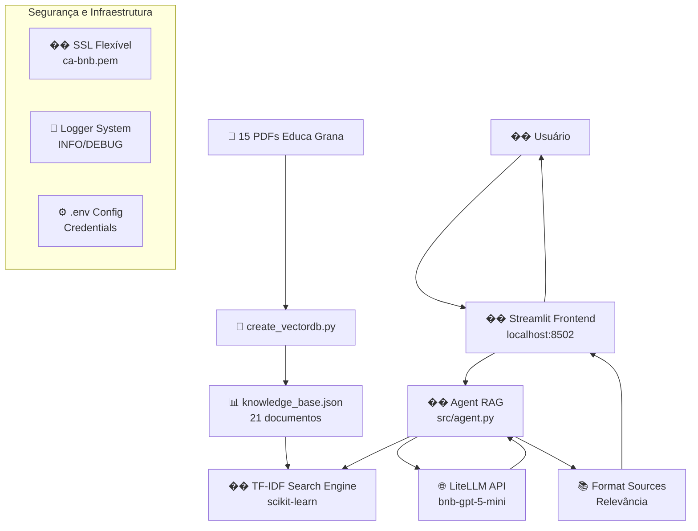

# 🤖 IAmiga - Assistente Virtual Educa Grana

<div align="center">


**Sistema RAG (Retrieval-Augmented Generation) especializado em consultas sobre o Programa Educa Grana**

[Sobre o Projeto](#-sobre-o-projeto) • [Funcionalidades](#-funcionalidades-da-iamiga) • [Instalação Rápida](#-instalação-rápida) • [Como Usar](#-como-usar) • [Segurança](#-segurança) • [Suporte](#-suporte)

</div>

---

## 📖 Sobre o Projeto

O **Educa Grana** é um aplicativo que propõe uma **"Educação que faz diferença"** para **comunidades de baixa renda**, com foco nos beneficiários do **Bolsa Família**. Desenvolvido como uma atividade extensionista acadêmica, o projeto tem como missão principal o desenvolvimento de um aplicativo de educação financeira, ensinando habilidades financeiras básicas e fornecendo acesso a informações sobre programas de assistência social.

Seus objetivos primordiais são:
- 🌍 **Inclusão Financeira:** Oferecer acesso online a conteúdos de educação financeira, ensinando habilidades fundamentais de gestão de orçamento, poupança, investimento e controle de dívidas.
- 💪 **Empoderamento Econômico e Social:** Capacitar populações vulneráveis para tomar decisões conscientes, estimulando autoconfiança e autoestima, e contribuindo para uma vida mais estável e resiliente.
- 📈 **Redução das Desigualdades:** Contribuir para romper o ciclo da pobreza e promover uma sociedade mais justa e resiliente, oferecendo oportunidades de aprendizado e desenvolvimento financeiro.

A tecnologia, neste contexto, é empregada como uma ferramenta estratégica para gerar impacto social, combinando **educação digital** com **informações sobre programas de assistência social**.

O projeto está alinhado com os **Objetivos de Desenvolvimento Sustentável (ODS)** da ONU (ODS 01: Erradicação da pobreza, ODS 04: Educação de qualidade, ODS 08: Trabalho decente e crescimento econômico).

---

## ✨ Funcionalidades da IAmiga

A **IAmiga** é a assistente virtual inteligente do Educa Grana, projetada para fornecer informações precisas e acolhedoras.

- **Interface Amigável:** Chat moderno via Streamlit com histórico de conversas.
- **Personalidade Humanizada:** Respostas acolhedoras e cordiais, como uma amiga ajudando.
- **Busca Semântica TF-IDF:** Recuperação rápida e eficiente (< 0.01s para 21 documentos) de informações na base de conhecimento.
- **Query Rewrite + Re-ranking:** Expansão inteligente de perguntas com glossário de domínio para melhorar a relevância das respostas.
- **Conteúdo Educativo:** Oferece orientações claras e concisas sobre tópicos essenciais para o público do Educa Grana, como planejamento de orçamento, poupança, investimento e gestão de dívidas, adaptados para fácil compreensão.
- **Feedback Loop:** Sistema de votos (👍��) e telemetria para melhoria contínua da qualidade das respostas.
- **Segurança:** Suporte a certificados corporativos customizados (SSL Flexível) e credenciais protegidas via variáveis de ambiente.

### 🏗️ Arquitetura do Sistema



---

## 🚀 Instalação Rápida

Para ter a IAmiga rodando localmente, siga estes passos:

### 1. **Pré-requisitos**

Certifique-se de ter Python 3.13+ e Git instalados.

### 2. **Clone e Configuração Inicial**

```powershell
# Clone o repositório
git clone https://github.com/esantanap/Educa-Grana.git
cd Educa-Grana

# Criar e ativar ambiente virtual
python -m venv venv
.\venv\Scripts\activate  # Windows
# source venv/bin/activate  # Linux/Mac

# Instalar dependências
pip install -r requirements.txt
```

### 3. **Configuração de Ambiente (`.env`)**

Copie o arquivo `.env.example` para `.env` e edite-o com suas credenciais e configurações de ambiente.

```bash
# Exemplo de .env
OPENAI_API_KEY=sua_chave_api_aqui
OPENAI_BASE_URL=https://bn-s654-litellm-dev.wonderfulmoss-11cca4da.brazilsouth.azurecontainerapps.io
OPENAI_MODEL=bnb-gpt-5-mini
REQUESTS_CA_BUNDLE=C:\Users\SEU_USER\certs\ca-bnb.pem
SSL_CERT_FILE=C:\Users\SEU_USER\certs\ca-bnb.pem
ALLOW_INSECURE_SSL=false
```

### 4. **Preparar Base de Conhecimento**

Os PDFs do Educa Grana (15 arquivos) já estão na pasta `data/docs/`. Para processá-los e criar a base de conhecimento `knowledge_base.json` (com 21 documentos indexados):

```powershell
python src/create_vectordb.py
```

### 5. **Iniciar o Sistema**

```powershell
# Ativar ambiente (se não ativado)
.\venv\Scripts\activate

# Iniciar Streamlit
streamlit run src\core\frontend\app.py
```
A interface estará disponível em: `http://localhost:8502`.

---

## 📚 Como Usar

### 1. **Interagindo com a IAmiga (Interface Streamlit)**

1.  **Acesse:** Abra seu navegador e vá para `http://localhost:8502`.
2.  **Digite:** Faça sua pergunta sobre o Educa Grana na caixa de texto.
3.  **Visualize:** A IAmiga responderá de forma acolhedora, com informações fundamentadas e citando as fontes consultadas.
4.  **Feedback:** Use os botões 👍 ou 👎 para nos ajudar a melhorar continuamente.

### 2. **Exemplos de Perguntas**

**✅ Perguntas Eficazes:**
- "O que faço para não pagar juros no meu cartão?"
- "Não tenho dinheiro para pagar o cartão, o que posso fazer?"
- "Perdi o emprego, o que devo fazer agora com minhas finanças?"
- "Estou pensando em empreender, que dicas financeiras o Educa Grana tem?"
- "Como o Educa Grana me ajuda a criar um orçamento?"

**❌ Evite:**
- Perguntas muito genéricas ("Me fale tudo")
- Perguntas fora do escopo (não relacionadas ao Educa Grana)
- Múltiplas perguntas em uma única mensagem

### 3. **Usar Diretamente via Python (para desenvolvedores)**

Para integração ou testes automatizados, você pode usar a função `answer_question` diretamente:

```python
from src.agent import answer_question

question = "Quais são as dicas do Educa Grana para economizar dinheiro?"
response = answer_question(question)
print(response)
```

---

## 🔒 Segurança

A IAmiga foi desenvolvida com foco em segurança, incluindo:
- **SSL/TLS Configurável:** Suporte a certificados corporativos via variáveis de ambiente (`REQUESTS_CA_BUNDLE`, `SSL_CERT_FILE`) com um sistema de fallback robusto.
- **Credenciais Protegidas:** Sem chaves de API hardcoded; todas as credenciais são gerenciadas via arquivo `.env`, que não é versionado.
- **Logging Seguro:** Logs estruturados que mascaram informações sensíveis, como chaves de API.

---

## 📁 Estrutura do Projeto

```
iAmiga/
├── 📄 README.md                      # Este arquivo
├── 📝 .env.example                   # Template de configuração
├── 🔒 .env                           # Configuração local (não commitado)
├── 📋 requirements.txt               # Dependências do projeto
│
├── 📂 src/                           # Código fonte principal
│   ├── 🤖 agent.py                   # ⭐ Agente RAG principal (busca TF-IDF, API LLM, citação de fontes)
│   ├── 🔄 create_vectordb.py         # Processador de PDFs → JSON
│   │
│   └── 📂 core/                      # Módulos core
│       └── 📂 frontend/
│           └── �� app.py             # Interface Streamlit
│
├── 📂 data/                          # Dados do sistema
│   ├── 📊 knowledge_base.json        # ⭐ Base de conhecimento indexada (21 documentos)
│   │
│   └── 📂 docs/                      # Documentos fonte (15 PDFs + 1 TXT)
│
└── 📂 scripts/                       # Scripts utilitários e de manutenção (ex: glossário, análise)
```

---

## 📝 Histórico de Mudanças

As principais atualizações e melhorias podem ser consultadas em nosso histórico de versões.

---

## 📞 Suporte

**Desenvolvido por:**
- Fábrica de IA

**Repositório:**
- <https://github.com/esantanap/Educa-Grana.git>

---

## �� Licença

Copyright © 2026 Elisangela Santana - Todos os direitos reservados.