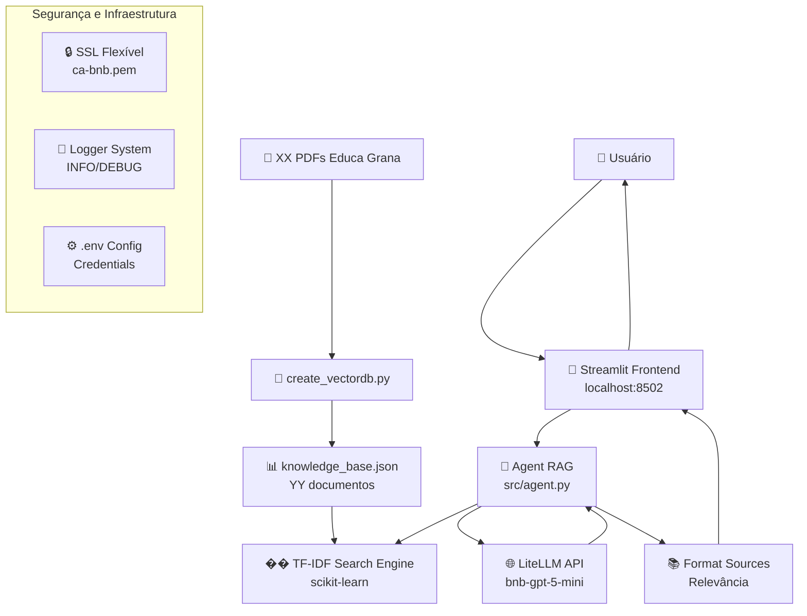

# �� IAmiga - Assistente Virtual Educa Grana

<div align="center">

`https://img.shields.io/badge/Python-3.13+-blue.svg`
`https://img.shields.io/badge/LangChain-0.1.x-green.svg`
`https://img.shields.io/badge/Streamlit-1.28+-red.svg`
`https://img.shields.io/badge/Search-TF--IDF-orange.svg`
`https://img.shields.io/badge/Status-Production%20Ready-brightgreen.svg`

**Sistema RAG (Retrieval-Augmented Generation) especializado em consultas sobre o Programa Educa Grana**

</div>

---

## 📖 Sobre o Projeto

O **Educa Grana** é um aplicativo que propõe uma **"Educação que faz diferença"** para **comunidades de baixa renda**, com foco nos beneficiários do **Bolsa Família**. Desenvolvido como uma atividade extensionista acadêmica, o projeto tem como missão principal o desenvolvimento de um aplicativo de educação financeira, ensinando habilidades financeiras básicas e fornecendo acesso a informações sobre programas de assistência social.

Seus objetivos primordiais são:
- 🌍 **Inclusão Financeira:** Oferecer acesso online a conteúdos de educação financeira, ensinando habilidades fundamentais de gestão de orçamento, poupança, investimento e controle de dívidas.
- 💪 **Empoderamento Econômico e Social:** Capacitar populações vulneráveis para tomar decisões conscientes, estimulando autoconfiança e autoestima, e contribuindo para uma vida mais estável e resiliente.
- 📈 **Redução das Desigualdades:** Contribuir para romper o ciclo da pobreza e promover uma sociedade mais justa e resiliente, oferecendo oportunidades de aprendizado e desenvolvimento financeiro.

A tecnologia, neste contexto, é empregada como uma ferramenta estratégica para gerar impacto social, combinando **educação digital** com **informações sobre programas de assistência social**.

---

## �� Objetivos Sociais

O projeto está alinhado com os **Objetivos de Desenvolvimento Sustentável (ODS)** da ONU:

- **ODS 01:** Erradicação da pobreza
- **ODS 04:** Educação de qualidade
- **ODS 08:** Trabalho decente e crescimento econômico

**Resultados esperados:**
- Aumento do uso de serviços financeiros formais
- Redução de dívidas e desperdícios
- Melhoria na alfabetização financeira

---

## ✨ Funcionalidades da IAmiga

- **Interface Amigável:** Chat moderno via Streamlit com histórico de conversas
- **Personalidade Humanizada:** Respostas acolhedoras e cordiais, como uma amiga ajudando
- **Busca Semântica TF-IDF:** Recuperação rápida e eficiente (< 0.01s para YY documentos)
- **Query Rewrite + Re-ranking:** Expansão inteligente de queries com glossário de domínio
- **Conteúdo Educativo:** Oferece orientações claras e concisas sobre tópicos essenciais para o público do Educa Grana, como planejamento de orçamento, poupança, investimento e gestão de dívidas, adaptados para fácil compreensão.
- **Feedback Loop:** Sistema de votos (👍👎) e telemetria para melhoria contínua
- **SSL Flexível:** Suporte a certificados corporativos customizados
- **Logging Completo:** Sistema de logs estruturado para debugging

---

## 🏗️ Arquitetura do Sistema



---

## 📊 Estatísticas da Base de Conhecimento

- **📄 Documentos fonte:** XX PDFs + 1 TXT (Educa Grana_base.txt)
- **📚 Chunks processados:** YY documentos indexados
- **🔍 Vetores TF-IDF:** 5000 features extraídas
- **⚡ Performance:** < 0.001s para busca em YY documentos
- **🏷️ Metadados:** kind, title, section, version_date para cada documento

---

## 🚀 Instalação Rápida

### 1. **Pré-requisitos**

```powershell
# Python 3.13 ou superior
python --version

# Git para clone do repositório
git --version

# PowerShell (Windows) ou Bash (Linux/Mac)
```

### 2. **Clone e Configuração Inicial**

```powershell
# Clone o repositório
git clone https://github.com/esantanap/Educa-Grana.git


# Criar e ativar ambiente virtual
python -m venv venv
.\venv\Scripts\activate  # Windows
# source venv/bin/activate  # Linux/Mac

# Instalar dependências
pip install -r requirements.txt
```

### 3. **Configuração de Ambiente**

```powershell
# Copiar template de configuração
copy .env.example .env

# Editar .env com suas credenciais
notepad .env  # Windows
# nano .env  # Linux/Mac
```

**Variáveis OBRIGATÓRIAS no `.env`:**

```bash
# === API LLM ===
OPENAI_API_KEY=sua_chave_api_aqui
OPENAI_BASE_URL=https://bn-s654-litellm-dev.wonderfulmoss-11cca4da.brazilsouth.azurecontainerapps.io
OPENAI_MODEL=bnb-gpt-5-mini

# === SSL Corporativo (BNB) ===
REQUESTS_CA_BUNDLE=C:\Users\SEU_USER\certs\ca-bnb.pem
SSL_CERT_FILE=C:\Users\SEU_USER\certs\ca-bnb.pem

# === Desenvolvimento (Opcional) ===
ALLOW_INSECURE_SSL=false  # Apenas para desenvolvimento
```

### 4. **Preparar Base de Conhecimento**

```powershell
# Adicionar PDFs na pasta data/docs/
# Já existe Educa Grana_base.txt + XX PDFs

# Processar documentos e criar knowledge_base.json
python src/create_vectordb.py

# Resultado esperado:
# ✅ XX PDFs processados
# ✅ YYYY documentos extraídos
# ✅ knowledge_base.json criado
```

### 5. **Iniciar o Sistema**

```powershell
# Ativar ambiente (se não ativado)
.\venv\Scripts\activate

# Iniciar Streamlit
streamlit run src\core\frontend\app.py

# Interface disponível em:
# 🌐 Local: http://localhost:8502
# �� Network: http://SEU_IP:8502
```

---

## ⚙️ Configuração

### 📝 Arquivo `.env`

```bash
# ===================================================================
# iAmiga - Configuração de Ambiente
# ===================================================================

# === API LLM (OBRIGATÓRIO) ===
OPENAI_API_KEY=sua_chave_api_aqui
OPENAI_BASE_URL=https://bn-s654-litellm-dev.wonderfulmoss-11cca4da.brazilsouth.azurecontainerapps.io
OPENAI_MODEL=bnb-gpt-5-mini

# === SSL/TLS (OBRIGATÓRIO para BNB) ===
# Caminho para certificado corporativo ca-bnb.pem
REQUESTS_CA_BUNDLE=C:\Users\Elis\certs\ca-bnb.pem
SSL_CERT_FILE=C:\Users\Elis\certs\ca-bnb.pem

# === Desenvolvimento (OPCIONAL) ===
# Permitir SSL inseguro APENAS em desenvolvimento
# NUNCA use em produção!
ALLOW_INSECURE_SSL=false

# === Logging (OPCIONAL) ===
LOG_LEVEL=INFO  # DEBUG | INFO | WARNING | ERROR
```

### 🔧 Configurações Disponíveis

| Variável | Padrão | Descrição |
|----------|--------|-----------|
| `OPENAI_API_KEY` | *Obrigatório* | Chave de API para LLM |
| `OPENAI_BASE_URL` | *Obrigatório* | URL base da API LiteLLM |
| `OPENAI_MODEL` | bnb-gpt-5-mini | Modelo LLM a ser utilizado |
| `REQUESTS_CA_BUNDLE` | *Obrigatório* | Caminho do certificado SSL corporativo |
| `SSL_CERT_FILE` | *Obrigatório* | Caminho alternativo para certificado SSL |
| `ALLOW_INSECURE_SSL` | false | Permitir SSL inseguro (dev apenas) |
| `LOG_LEVEL` | INFO | Nível de logging (DEBUG, INFO, WARNING, ERROR) |

---

## 📚 Como Usar

### 1. **Interface Streamlit**

```powershell
# Iniciar interface
streamlit run src\core\frontend\app.py
```

**Fluxo de uso:**

1. **Acesse:** http://localhost:8502
2. **Digite:** Sua pergunta sobre Educa Grana
3. **Aguarde:** Processamento da busca e geração da resposta
4. **Visualize:**
   - Resposta formatada da IAmiga
5. **Vote:** Use os botões 👍 ou 👎 para feedback (opcional)
   - Seção "📚 Fontes consultadas" com relevância
   - Indicação do tipo de busca utilizada

### 2. **Exemplos de Perguntas**

**✅ Perguntas Eficazes:**
- "O que faço para não pagar juros ?"
- "Não tenho grana para pagar o cartão, o que faço"
- "Perdi o emprego o que faço agora?"
- "Estou pensando em emprrender, o que devo fazer?"


**❌ Evite:**
- Perguntas muito genéricas ("Me fale tudo")
- Perguntas fora do escopo (não relacionadas ao Educa Grana)
- Múltiplas perguntas em uma única mensagem

### 3. **Resposta Típica**

```
Olá! Que bom te ver aqui! Vou te explicar sobre o Educa Grana...

O Educa Grana é um aplicativo de educação financeira voltado para comunidades de baixa renda, especialmente os beneficiários do Bolsa Família. Ele foi desenvolvido para ensinar habilidades financeiras básicas e fornecer acesso a informações sobre programas de assistência social. O objetivo principal é promover a inclusão financeira, o empoderamento econômico e social, e a redução das desigualdades.

Alguns pontos importantes:
• Foco em habilidades de gestão financeira (orçamento, poupança, dívidas).
• Capacita os usuários a tomar decisões conscientes e melhorar sua situação financeira.
• Contribui para romper o ciclo da pobreza e construir uma sociedade mais justa.

📚 Fontes consultadas:
1. **Atividades Extensionistas - Elisangela Santana - RU 4296109-Final.pdf** (relevância: 0.92)

🧠 Resposta gerada com busca semântica

Estou aqui se precisar de mais alguma informação!

🤖 IAmiga - Assistente Virtual do Educa Grana
```

### 4. **Usar Diretamente via Python**

```python
from src.agent import answer_question

# Fazer uma pergunta
question = "O que é o Educa Grana?"
response = answer_question(question)

print(response)
```

---

## �� Glossário e Query Rewrite

O sistema utiliza um **glossário de domínio** para expandir automaticamente as queries do usuário, melhorando a cobertura e relevância dos resultados.

### �� Como Funciona

**1. Normalização Morfológica:**
- Remove acentos: `"operação"` → `"operacao"`
- Singulariza: `"operações"` → `"operacao"`
- Trata plural/singular automaticamente

**2. Expansão com Glossário:**
```
Query: "Qual o prazo da operação?"
↓ Normalização
"qual o prazo da operacao"
↓ Expansão (via glossário)
"qual o prazo da operacao emprestimo contrato ccb financiamento"
```

**3. Re-ranking Heurístico:**
- Boost por tipo de documento (normativo: +30%, procedimento: +25%)
- Boost por match no título (+5% por hit)
- Penalidade por tamanho excessivo (-10%)

### 📝 Gerenciar Glossário

**Arquivo:** `src/core/domain/glossario.json`

**Opção 1 - Script Interativo (Recomendado):**
```bash
python scripts/add_to_glossary.py
```

**Menu:**
1. ➕ Adicionar/editar alias
2. ⚖️ Ajustar doc_boost
3. 🛑 Adicionar termo protegido
4. �� Ver glossário completo

**Opção 2 - Edição Manual:**
```json
{
  "aliases": {
    "operação": ["empréstimo", "contrato", "ccb"],
    "prazo": ["vencimento", "período", "duração"]
  },
  "stop_expansion_in": ["CNPJ", "CPF"],
  "doc_boosts": {
    "normativo": 1.3,
    "procedimento": 1.25
  }
}
```

**📚 Guia Completo:** [COMO_ADICIONAR_AO_GLOSSARIO.md](COMO_ADICIONAR_AO_GLOSSARIO.md)

---

## �� Análise e Feedback Loop

Sistema de telemetria e análise para **aprendizado contínuo** baseado no uso real.

### 🔄 Ciclo de Melhoria

```
1. COLETAR → Telemetria registra queries + votos (👍👎)
2. ANALISAR → Scripts semanais geram relatórios
3. AJUSTAR → Atualizar glossário baseado em dados
4. VALIDAR → Monitorar impacto das mudanças
5. REPETIR → Ciclo contínuo de melhoria
```

### 📈 Análise Semanal

**Executar análise completa:**
```bash
python scripts/run_weekly_analysis.py
```

**Gera:**
- `data/telemetry_report.html` - Dashboard visual com métricas
- `data/glossary_suggestions.md` - Sugestões de melhorias

**Métricas incluídas:**
- Taxa de expansão de queries (meta: > 60%)
- Taxa de satisfação dos usuários (meta: > 75%)
- Top queries mais frequentes
- Queries com muitos votos negativos
- Termos candidatos ao glossário
- Ajustes recomendados em `doc_boosts`

### �� Scripts Disponíveis

| Script | Função |
|--------|--------|
| `scripts/analyze_telemetry.py` | Análise de telemetria + dashboard HTML |
| `scripts/suggest_glossary_updates.py` | Sugestões de melhorias no glossário |
| `scripts/run_weekly_analysis.py` | Análise completa (executar semanalmente) |
| `scripts/add_to_glossary.py` | Editor interativo do glossário |

**📚 Documentação:** [FEEDBACK_LOOP_IMPLEMENTATION.md](FEEDBACK_LOOP_IMPLEMENTATION.md)

### 📅 Execução Agendada (Recomendado)

**Windows - Task Scheduler:**
- Gatilho: Semanal (segunda-feira, 9h)
- Ação: `python.exe scripts\run_weekly_analysis.py`

**Linux/Mac - Crontab:**
```bash
# Toda segunda-feira às 9h
0 9 * * 1 cd /path/to/iAmiga && python scripts/run_weekly_analysis.py
```

---

## �� Segurança

### **Melhorias de Segurança Implementadas**

✅ **SSL/TLS Configurável:**
- Certificados corporativos via variáveis de ambiente
- Sistema de fallback em 3 níveis:
  1. Certificado customizado (`REQUESTS_CA_BUNDLE`)
  2. Certificados padrão do sistema
  3. Inseguro (apenas se `ALLOW_INSECURE_SSL=true`)

✅ **Credenciais Protegidas:**
- Sem hardcoding de API keys no código
- Arquivo `.env` no `.gitignore`
- Template `.env.example` para referência

✅ **Logging Seguro:**
- API keys são mascaradas nos logs
- Logs sem emojis (compatível com Windows cp1252)
- Níveis de log configuráveis

### **Configuração SSL Corporativa**

```bash
# 1. Obter certificado ca-bnb.pem da sua organização
# 2. Salvar em local seguro (ex: C:\Users\SEU_USER\certs\)
# 3. Configurar no .env:

REQUESTS_CA_BUNDLE=C:\Users\SEU_USER\certs\ca-bnb.pem
SSL_CERT_FILE=C:\Users\SEU_USER\certs\ca-bnb.pem
```

### **Verificar Configuração SSL**

```python
# Teste rápido de SSL
python test_security_improvements.py

# Saída esperada:
# ✅ Certificado SSL encontrado: C:\Users\...\ca-bnb.pem
# ✅ OPENAI_API_KEY: sk-...****
# ✅ Agent importado com sucesso!
```

---

## 📁 Estrutura do Projeto

```
iAmiga/
├── �� README.md                      # Este arquivo
├── 📝 .env.example                   # Template de configuração
├── 🔒 .env                           # Configuração local (criar, não commitado)
├── 📋 requirements.txt               # Dependências otimizadas (15 pacotes)
├── 📦 requirements.old.txt           # Backup das dependências antigas
├── 📄 ARCHIVE_REMOVED.md             # Documentação de arquivos removidos
│
├── 📂 src/                           # Código fonte principal
│   ├── 🤖 agent.py                   # ⭐ Agente RAG principal (514 linhas)
│   ├── 🔄 create_vectordb.py         # Processador de PDFs → JSON
│   │
│   └── �� core/                      # Módulos core
│       ├── ⚙️ config.py              # Configurações do sistema
│       ├── 🔗 embedding.py           # (Legado - não usado)
│       ├── 📄 loader.py              # (Legado - não usado)
│       ├── 🔍 retriever.py           # (Legado - não usado)
│       │
│       └── 📂 frontend/
│           └── 🎨 app.py             # Interface Streamlit
│
├── 📂 data/                          # Dados do sistema
│   ├── 📊 knowledge_base.json        # ⭐ Base indexada (YY docs)
│   │
│   └── �� docs/                      # Documentos fonte
│       ├── 📕 Educa Grana_base.txt    # Base textual
│       └── 📕 *.pdf                  # XX PDFs do Educa Grana
│
├── 📂 scripts/                       # Scripts utilitários
│   ├── �� check_imports.py           # Verificar dependências
│   ├── 🧪 langchain_llm_test.py      # Teste de LLM
│   ├── 🧪 test_embeddings.py         # Teste de embeddings
│   └── 🌐 test_httpx_tls.py          # Teste de conectividade
│
├── �� test_*.py                      # Scripts de teste do sistema
├── 📂 venv/                          # Ambiente virtual (auto-criado)
└── 📂 chroma/                        # ChromaDB (não usado atualmente)
```

### **Arquivos Principais**

| Arquivo | Linhas | Descrição |
|---------|--------|-----------|
| `src/agent.py` | 514 | **Core do sistema:** busca TF-IDF, API LLM, citação de fontes |
| `src/create_vectordb.py` | ~100 | Processa PDFs e cria knowledge_base.json |
| `src/core/frontend/app.py` | ~150 | Interface Streamlit com chat |
| `data/knowledge_base.json` | YY docs | Base de conhecimento indexada |
| `requirements.txt` | 15 deps | Dependências otimizadas |

---

## 🧪 Testes e Diagnósticos

### **Script de Teste Completo**

```powershell
# Teste de segurança e funcionalidade
python test_security_improvements.py
```

**Saída esperada:**

```
🧪 TESTE DAS MELHORIAS DE SEGURANÇA - iAmiga
═══════════════════════════════════════════════

🔑 Testando variáveis de ambiente...
✅ OPENAI_API_KEY: sk-proj...****
✅ OPENAI_BASE_URL: https://bn-s654...
✅ OPENAI_MODEL: bnb-gpt-5-mini
🔒 Testando configuração SSL...
✅ Certificado SSL encontrado: C:\Users\...\ca-bnb.pem

📦 Testando importação do agent...
✅ Agent importado com sucesso!
✅ SSL configurado: C:\Users\...\ca-bnb.pem

❓ Testando pergunta simples...
Pergunta: O que é o Educa Grana?
Processando...
✅ Resposta recebida (1123 caracteres)

📊 RESUMO DOS TESTES
═══════════════════════════════════════════════
✅ PASSOU - Variáveis de ambiente
✅ PASSOU - Configuração SSL
✅ PASSOU - Importação do Agent
✅ PASSOU - Processamento de pergunta
Total: 4/4 testes passaram
🎉 TODOS OS TESTES PASSARAM!
```

### **Testar Apenas o Agent**

```powershell
# Executar teste direto do agent
python src/agent.py

# Logs esperados:
# [KB] Base carregada: YY documentos
# [ENGINE] Sistema TF-IDF inicializado! Vetores: (YY, 5000)
# [SEARCH] Busca TF-IDF: 5 resultados em 0.001s
# [API] Sucesso com certificado customizado
# [AGENT] Resposta gerada com sucesso!
```

### **Scripts de Diagnóstico**

```powershell
# Verificar dependências instaladas
python scripts/check_imports.py

# Testar conectividade TLS
python scripts/test_httpx_tls.py

# Testar LLM diretamente
python scripts/langchain_llm_test.py
```

---

## 🛠️ Solução de Problemas

### **Erro: "Base de conhecimento não encontrada"**

```powershell
# Solução: Criar base de conhecimento
python src/create_vectordb.py

# Verificar se arquivo foi criado
dir data\knowledge_base.json
```

### **Erro: "SSL Certificate Verify Failed"**

```powershell
# Solução 1: Configurar certificado corporativo
# Editar .env:
REQUESTS_CA_BUNDLE=C:\Users\SEU_USER\certs\ca-bnb.pem

# Solução 2: Para desenvolvimento APENAS
# Editar .env:
ALLOW_INSECURE_SSL=true  # NUNCA em produção!
```

### **Erro: "Module not found"**

```powershell
# Solução: Reinstalar dependências
pip install -r requirements.txt

# Verificar instalação
python -c "import streamlit, sklearn, requests; print('✅ OK')"
```

### **Erro: "Port 8502 already in use"**

```powershell
# Solução: Matar processo na porta 8502
Get-Process -Name streamlit | Stop-Process -Force

# Ou usar porta diferente
streamlit run src\core\frontend\app.py --server.port 8503
```

### **Streamlit não inicia**

```powershell
# Verificar se está no diretório correto
cd C:\Users\...\iAmiga

# Verificar se ambiente virtual está ativo
.\venv\Scripts\activate

# Verificar caminho do arquivo
Test-Path src\core\frontend\app.py  # Deve retornar True
```

### **Logs com caracteres estranhos (Windows)**

✅ **Já resolvido!** Emojis foram removidos dos logs para compatibilidade com Windows cp1252.

Os emojis aparecem apenas nas respostas ao usuário (Streamlit suporta UTF-8).

---

## 📝 Histórico de Mudanças

### **v2.1.0 - Janeiro 2026** (Atual)

**🎭 Personalidade Humanizada:**
- ✅ Prompt otimizado para respostas mais humanas e cordiais
- ✅ Tom natural de "amiga ajudando" ao invés de assistente robótica
- ✅ Empatia e interesse genuíno nas interações
- ✅ Cumprimentos calorosos e despedidas acolhedoras
- ✅ Frases naturais: "Vou te explicar...", "Entendo sua dúvida...", "Fico feliz em ajudar!"
- ✅ Respostas objetivas (3-4 parágrafos) mas com calor humano
- ✅ Uso moderado de emojis para transmitir cordialidade

**🔧 Correções:**
- ✅ Removido caractere inválido (erro de sintaxe na linha 539 do agent.py)

### **v2.0.0 - Janeiro 2026** (Commit: b7a95b6)

**🔍 Query Intelligence:**
- ✅ Query Rewrite com glossário de domínio (10+ grupos de aliases)
- ✅ Normalização morfológica (singular/plural + acentos)
- ✅ Re-ranking heurístico (boost por tipo + título + tamanho)
- ✅ Telemetria de queries e expansões

**📊 Feedback Loop:**
- ✅ Sistema de votos (👍👎) na interface Streamlit
- ✅ Análise automática de telemetria (scripts/analyze_telemetry.py)
- ✅ Sugestões inteligentes de glossário (scripts/suggest_glossary_updates.py)
- ✅ Dashboard HTML com métricas visuais
- ✅ Editor interativo de glossário (scripts/add_to_glossary.py)

**📚 Metadados Enriquecidos:**
- ✅ Classificação automática de documentos (kind: normativo, procedimento, etc.)
- ✅ Extração de versão/data dos PDFs
- ✅ Extração de títulos dos documentos
- ✅ YY documentos com metadados completos

**📖 Documentação:**
- ✅ COMO_ADICIONAR_AO_GLOSSARIO.md - Guia completo do glossário
- ✅ FEEDBACK_LOOP_IMPLEMENTATION.md - Sistema de análise
- ✅ scripts/README.md - Documentação dos scripts

---

## �� Suporte

**Desenvolvido por:**
- Banco do iAmiga - CINN (Centro de Inovação)
- Fábrica de IA

**Repositório:**
- https://github.com/esantanap/Educa-Grana.git

**Documentação adicional:**
- [.env.example](.env.example) - Template de configuração
- [ARCHIVE_REMOVED.md](ARCHIVE_REMOVED.md) - Arquivos removidos
- [requirements.old.txt](requirements.old.txt) - Dependências antigas


## 📚 Como Usar

1. Acesse a interface via **http://localhost:8502**
2. Digite sua pergunta sobre o **Educa Grana**
3. Receba respostas acolhedoras e fundamentadas em documentos oficiais
4. Consulte as fontes citadas e dê feedback com 👍 ou 👎

---

## 🔒 Segurança

- Certificados SSL corporativos configuráveis
- Credenciais protegidas via `.env`
- Logs estruturados sem exposição de dados sensíveis

---

## �� Licença

Copyright © 2026 Elisangela Santana - Todos os direitos reservados.